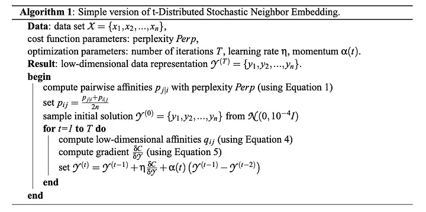
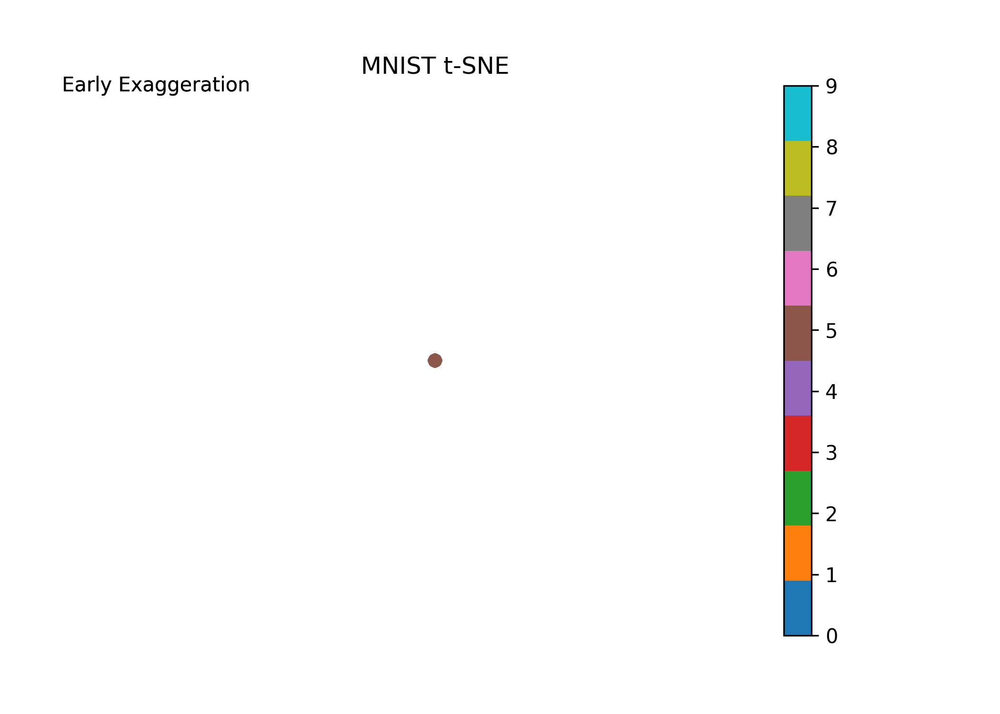

```{python}
#| echo: false
#| output: asis

import sys
sys.path.insert(0, "..")

from html_helpers import parallax_split_cover

parallax_split_cover(
    cover_image="cover.webp",
    kicker="Machine Learning • Manifold Learning",
    title='t-SNE from Scratch (ft. NumPy)',
    subtitle="Acquire a deep understanding of the inner workings of t-SNE via implementation from scratch in python.",
    chips=("KL Divergence", "Perplexity", "Neighbor Embedding"),
    takeaways=(
        "t-SNE preserves local neighborhood structure by matching pairwise affinities.",
        "Perplexity controls effective neighborhood size via σ selection.",
        "Optimization minimizes KL(P∥Q) using a Student-t kernel in low dimensions.",
    ),
    equation_latex=r"C=\sum_i\sum_j p_{ij}\log\frac{p_{ij}}{q_{ij}}",
)
```

```{python}
#| code-fold: true
#| code-summary: "Imports and Settings"

import warnings

import matplotlib.pyplot as plt
import numpy as np
import pandas as pd
from matplotlib import animation
from sklearn.datasets import fetch_openml
from sklearn.decomposition import PCA

np.seterr(divide="ignore", invalid="ignore")
warnings.simplefilter("ignore", RuntimeWarning)
warnings.filterwarnings("ignore")
```

## Introduction

I have found that one of the best ways to truly understanding any statistical algorithm or methodology is to manually implement it yourself. On the flip side, coding these algorithms can sometimes be time consuming and a real pain, and when somebody else has already done it, why would I want to spend my time doing it — seems inefficient, no? Both are fair points, and I am not here to make an argument for one over the other.

This article is designed for readers who are interested in understanding t-SNE via translation of the mathematics in the [original paper](https://jmlr.org/papers/volume9/vandermaaten08a/vandermaaten08a.pdf) — by Laurens van der Maaten & Geoffrey Hinton — into python code implementation.[^1] I find these sort of exercises to be quite illuminating into the inner workings of statistical algorithms/models and really test your underlying understanding and assumptions regarding these algorithms/models. You are almost guaranteed to walk away with a better understanding then you had before. At the very minimum, successful implementation is always very satisfying!

This article will be accessible to individuals with any level of exposure of t-SNE. However, note a few things this post definitely is **not**:

1. A _strictly_ conceptual introduction and exploration of t-SNE, as there are plenty of other great resources out there that do this; nevertheless, I will be doing my best to connect the mathematical equations to their intuitive/conceptual counterparts at each stage of implementation.

2. A _comprehensive_ discussion into the applications & pros/cons of t-SNE, as well as direct comparisons of t-SNE to other dimensionality reduction techniques. I will, however, briefly touch on these topics throughout this article, but will by no means cover this in-depth.

Without further ado, let’s start with a _brief_ introduction into t-SNE.

## A Brief Introduction to t-SNE

_t-distributed stochastic neighbor embedding_ (t-SNE) is a dimensionality reduction tool that is primarily used in datasets with a large dimensional feature space and enables one to visualize the data down, or project it, into a lower dimensional space (usually 2-D). It is especially useful for visualizing non-linearly separable data wherein linear methods such as [Principal Component Analysis](https://en.m.wikipedia.org/wiki/Principal_component_analysis) (PCA) would fail. Generalizing linear frameworks of dimensionality reduction (such as PCA) into non-linear approaches (such as t-SNE) is also known as [Manifold Learning](https://en.m.wikipedia.org/wiki/Nonlinear_dimensionality_reduction). These methods can be extremely useful for visualizing and understanding the underlying structure of a high dimensional, non-linear data set, and can be great for disentangling and grouping together observations that are similar in the high-dimensional space. For more information on t-SNE and other manifold learning techniques, the [scikit-learn documentation](https://scikit-learn.org/stable/modules/manifold.html) is a great resource. Additionally, to read about some cool areas t-SNE has seen applications, the [Wikipedia page](https://en.wikipedia.org/wiki/T-distributed_stochastic_neighbor_embedding#cite_note-3) highlights some of these areas with references to the work.

Let’s start with breaking down the name _t-distributed stochastic neighbor embedding_ into its components. t-SNE is an extension on stochastic neighbor embedding (SNE) presented 6 years earlier in this [paper](https://cs.nyu.edu/~roweis/papers/sne_final.pdf) by Geoffrey Hinton & Sam Roweis. So let’s start there. The _stochastic_ part of the name comes from the fact that the objective function is not convex and thus different results can arise from different initializations. The _neighbor embedding_ highlights the nature of the algorithm — optimally mapping the points in the original high-dimensional space into the corresponding low-dimensional space while best preserving the “neighborhood” structure of the points. SNE is comprised of the following (simplified) steps:

1. _Obtain the Similarity Matrix between Points in the Original Space_: Compute the conditional probabilities for each datapoint $j$ relative to each datapoint $i$. These conditional probabilities are calculated in the original high-dimensional space using a Gaussian centered at $i$ and take on the following interpretation: the probability that i would pick $j$ as its neighbor in the original space. This creates a matrix that represents similarities between the points.

2. _Initialization_: Choose random starting points in the lower-dimensional space (say, 2-D) for each datapoint in the original space and compute new conditional probabilities similarly as above in this new space.

3. _Mapping_: Iteratively improve upon the points in the lower-dimensional space until the [Kullback-Leibler divergences](https://en.wikipedia.org/wiki/Kullback%E2%80%93Leibler_divergence) between all the conditional probabilities is minimized. Essentially we are minimizing the differences in the probabilities between the similarity matrices of the two spaces so as to ensure the similarities are best preserved in the mapping of the original high-dimensional dataset to the low-dimensional dataset.

t-SNE improves upon SNE in two primary ways:

1. It minimizes the Kullback-Leibler divergences between the joint probabilities rather than the conditional probabilities. The authors refer to this as “symmetric SNE” b/c their approach ensures that the joint probabilities $p_ij$ = $p_ji$. **This results in a much better behaved cost function that is easier to optimize.**

2. It computes the similarities between points using a [student's t-distribution](https://en.wikipedia.org/wiki/Student%27s_t-distribution) w/ one degree of freedom (also a [Cauchy Distribution](https://en.wikipedia.org/wiki/Cauchy_distribution)) rather than a Gaussian in the low-dimensional space (step 2 above). Here we can see where the “t” in t-SNE is coming from. **This improvement helps to alleviate the “crowding problem” highlighted by the authors and to further improve the optimization problem.** This “crowding problem” can be envisioned as such: Imagine we have a 10-D space, the amount of space available in 2-D will not be sufficient to accurately capture those moderately dissimilar points compared to the amount of space for nearby points relative to the amount of space available in a 10-D space. More simply, just envision taking a 3-D space and projecting it down to 2-D, the 3-D space will have much more overall space to model the similarities relative to the projection down into 2-D. The Student-t distribution helps alleviate this problem by having heavier tails than the normal distribution. See the [original paper](https://jmlr.org/papers/volume9/vandermaaten08a/vandermaaten08a.pdf) for a much more in-depth treatment of this problem.

If this did not all track immediately, that is okay! I am hoping when we implement this in code, the pieces will all fall in to place. The main takeaway is this: **t-SNE models similarities between datapoints in the high-dimensional space using joint probabilities of “datapoints choosing others as its neighbor”, and then tries to find the best mapping of these points down into the low-dimensional space, while best preserving the original high-dimensional similarities.**

## Implementation from Scratch

Let’s now move on to understanding t-SNE via implementing the original version of the algorithm as presented in the [paper](https://jmlr.org/papers/volume9/vandermaaten08a/vandermaaten08a.pdf) by Laurens van der Maaten & Geoffrey Hinton. We will first start with implementing algorithm 1 below step-by-step, which will cover 95% of the main algorithm. There are two additional enhancements the authors note: 1) Early Exaggeration & 2) Adaptive Learning Rates. We will only discuss adding in the early exaggeration as that is most conducive in aiding the interpretation of the actual algorithms inner workings, as the adaptive learning rate is focused on improving the rates of convergence.



### 1. Inputs

Following the original paper, we will be using the publicly available [MNIST dataset](https://www.openml.org/search?type=data&status=active&id=554&sort=runs) from OpenML with images of handwritten digits from 0–9.[^2] We will also randomly sample 1000 images from the dataset & reduce the dimensionality of the dataset using Principal Component Analysis (PCA) and keep 30 components. These are both to improve computational time of the algorithm, as the code here is not optimized for speed, but rather for interpretability & learning.

```{python}
#| code-fold: show
# Fetch MNIST data
mnist = fetch_openml("mnist_784", version=1, as_frame=False)
mnist.target = mnist.target.astype(np.uint8)

X_total = pd.DataFrame(mnist["data"])
y_total = pd.DataFrame(mnist["target"])

X_reduced = X_total.sample(n=1000)
y_reduced = y_total.loc[X_reduced.index]

# PCA to keep 30 components
X = PCA(n_components=30).fit_transform(X_reduced)
```

This will be our X dataset with each row being an image and each column being a feature, or principal component in this case (i.e. linear combinations of the original pixels):

```{python}
#| code-fold: true
pd.DataFrame(X)
```

We also will need to specify the cost function parameters — perplexity — and the optimization parameters — iterations, learning rate, & momentum. We will hold off on these for now and address them as they appear at each stage.

In terms of output, recall that we seek a the low-dimensional mapping of the original dataset X. We will be mapping the original space into a 2 dimensional space throughout this example. Thus, our new output will be the 1000 images now represented in a 2 dimensional space rather than the original 30 dimensional space, with a shape of [1000, 2].

### 2. Compute Affinities/Similarities of X in the Original Space

Now that we have our inputs, the first step is to compute the pairwise similarities in the original high dimensional space. That is, for each image $i$ we compute the probability that $i$ would pick image $j$ as its neighbor in the original space for each $j$. These probabilities are calculated via a normal distribution centered around each point and then are normalized to sum up to 1. Mathematically, we have:

$$
\begin{equation}
p_{j|i}=\frac{\exp{(-\|x_i-x_j\|^2/2\sigma_i^2)}}{\sum_{k\ne i}\exp{(-\|x_i-x_j\|^2/2\sigma_i^2)}}
\tag{1}
\end{equation}
$$

Note that, in our case with n = 1000, these computations will result in a 1000 x 1000 matrix of similarity scores. Note we set $p$ = 0 whenever $i$ = $j$ b/c we are modeling pairwise similarities. However, you may notice that we have not mentioned how $\sigma$ is determined. This value is determined for each observation $i$ via a grid search based on the user-specified desired [perplexity](https://en.wikipedia.org/wiki/Perplexity) of the distributions. We will talk about this immediately below, but let’s first look at how we would code eq. (1) above:

```{python}
#| code-fold: show
def get_original_pairwise_affinities(
    X: np.ndarray, perplexity: int = 10
) -> np.ndarray:
    """
    Function to obtain affinities matrix.

    Parameters
    ----------
    X
        The input data array.
    perplexity
        The perplexity value for the grid search.

    Returns
    ------
    np.ndarray
        The pairwise affinities matrix.
    """

    n = len(X)

    print("Computing Pairwise Affinities....")

    p_ij = np.zeros(shape=(n, n))
    for i in range(0, n):
        # Equation 1 numerator
        diff = X[i] - X
        σ_i = grid_search(diff, i, perplexity)  # Grid Search for σ_i
        norm = np.linalg.norm(diff, axis=1)
        p_ij[i, :] = np.exp(-(norm**2) / (2 * σ_i**2))

        # Set p = 0 when j = i
        np.fill_diagonal(p_ij, 0)

        # Equation 1
        p_ij[i, :] = p_ij[i, :] / np.sum(p_ij[i, :])

    # Set 0 values to minimum numpy value (ε approx. = 0)
    ε = np.nextafter(0, 1)
    p_ij = np.maximum(p_ij, ε)

    print("Completed Pairwise Affinities Matrix. \n")

    return p_ij
```

Now before we look at the results of this code, let’s discuss how we determine the values of $\sigma$ via the `grid_search()` function. Given a specified value of perplexity (which in this context can be loosely thought about as the number of nearest neighbors for each point), we do a grid search over a range of values of $\sigma$ such that the following equation is as close to equality as possible for each $i$:

$$
\begin{equation}
Perp(P_i)=2^{H(P_i)}
\tag{2}
\end{equation}
$$

where $H(P_i)$ is the Shannon entropy of $P$:

$$
\begin{equation}
H(P_i) = - \sum_jp_{j|i}\log_2p_{j|i}
\tag{2}
\end{equation}
$$

In our case, we will set perplexity = 10 and set the search space to be defined by [0.01 * standard deviation of the norms for the difference between images $i$ and $j$, 5 * standard deviation of the norms for the difference between images $i$ and $j$] divided into 200 equal steps. Knowing this, we can define our `grid_search()` function as follows:

```{python}
#| code-fold: show
def grid_search(diff_i: np.ndarray, i: int, perplexity: int) -> float:
    """
    Helper function to obtain σ's based on user-specified perplexity.

    Parameters
    -----------
    diff_i
        Array containing the pairwise differences between data points.
    i
        Index of the current data point.
    perplexity
        User-specified perplexity value.

    Returns
    -------
    float
        The value of σ that satisfies the perplexity condition.
    """

    result = np.inf  # Set first result to be infinity

    norm = np.linalg.norm(diff_i, axis=1)
    std_norm = np.std(
        norm
    )  # Use standard deviation of norms to define search space

    for σ_search in np.linspace(0.01 * std_norm, 5 * std_norm, 200):
        # Equation 1 Numerator
        p = np.exp(-(norm**2) / (2 * σ_search**2))

        # Set p = 0 when i = j
        p[i] = 0

        # Equation 1 (ε -> 0)
        ε = np.nextafter(0, 1)
        p_new = np.maximum(p / np.sum(p), ε)

        # Shannon Entropy
        H = -np.sum(p_new * np.log2(p_new))

        # Get log(perplexity equation) as close to equality
        if np.abs(np.log(perplexity) - H * np.log(2)) < np.abs(result):
            result = np.log(perplexity) - H * np.log(2)
            σ = σ_search

    return σ
```

Given these functions, we can compute the affinity matrix via:

```{python}
#| code-fold: show
p_ij = get_original_pairwise_affinities(X)
```

```{python}
#| code-fold: true
pd.DataFrame(p_ij)
```

Note, the diagonal elements are set to $\epsilon \approx 0$ by construction (whenever $i$ = $j$). Recall that a key extension of the t-SNE algorithm is to compute the joint probabilities rather than the conditional probabilities. This is computed simply as follow:

$$
\begin{equation}
p_{ij}=\frac{p_{j|i}+p_{i|j}}{2n}
\tag{3}
\end{equation}
$$

Thus, we can define a new function

```{python}
#| code-fold: show
def get_symmetric_p_ij(p_ij: np.ndarray) -> np.ndarray:
    """
    Function to obtain symmetric affinities matrix utilized in t-SNE.

    Parameters
    ----------
    p_ij
        The input affinity matrix.

    Returns
    np.ndarray
        The symmetric affinities matrix.
    """
    print("Computing Symmetric p_ij matrix....")

    n = len(p_ij)
    p_ij_symmetric = np.zeros(shape=(n, n))
    for i in range(0, n):
        for j in range(0, n):
            p_ij_symmetric[i, j] = (p_ij[i, j] + p_ij[j, i]) / (2 * n)

    # Set 0 values to minimum numpy value (ε approx. = 0)
    ε = np.nextafter(0, 1)
    p_ij_symmetric = np.maximum(p_ij_symmetric, ε)

    print("Completed Symmetric p_ij Matrix. \n")

    return p_ij_symmetric
```

Feeding in `p_ij` from above, we obtain the following symmetric affinities matrix:

```{python}
#| code-fold: show
p_ij_symmetric = get_symmetric_p_ij(p_ij)
```

```{python}
#| code-fold: true
pd.DataFrame(p_ij_symmetric)
```

Now we have completed the first main step in t-SNE! We computed the symmetric affinity matrix in the original high-dimensional space. Before we dive right into the optimization stage, we will discuss the main components of the optimization problem in the next two steps and then combine them into our for loop.

### 3. Sample Initial Solution & Compute Low Dimensional Affinity Matrix

Now we want to sample a random initial solution in the lower dimensional space as follows:

```{python}
#| code-fold: show
def initialization(
    X: np.ndarray, n_dimensions: int = 2, initialization: str = "random"
) -> np.ndarray:
    """
    Obtain initial solution for t-SNE either randomly or using PCA.

    Parameters
    ----------
    X
        The input data array.
    n_dimensions
        The number of dimensions for the output solution. Default is 2.
    initialization
        The initialization method. Can be 'random' or 'PCA'. Default is 'random'.

    Returns
    -------
    np.ndarray
        The initial solution for t-SNE.

    Raises
    -------
    ValueError
        If the initialization method is neither 'random' nor 'PCA'.
    """

    # Sample Initial Solution
    if initialization == "random" or initialization != "PCA":
        y0 = np.random.normal(loc=0, scale=1e-4, size=(len(X), n_dimensions))
    elif initialization == "PCA":
        X_centered = X - X.mean(axis=0)
        _, _, Vt = np.linalg.svd(X_centered)
        y0 = X_centered @ Vt.T[:, :n_dimensions]
    else:
        raise ValueError("Initialization must be 'random' or 'PCA'")

    return y0
```

```{python}
#| code-fold: show
y0 = initialization(X)
```

```{python}
#| code-fold: true
pd.DataFrame(y0)
```

Now, we want to compute the affinity matrix in this lower dimensional space. However, recall that we do this utilizing a student's t-distribution w/ 1 degree of freedom:

$$
\begin{equation}
q_{ij}=\frac{(1+\|y_i-y_j\|^2)^{-1}}{\sum_{k \ne l} (1+\|y_i-y_j\|^2)^{-1}}
\tag{4}
\end{equation}
$$

Again, we set $q=0$ whenever $i = j$. Note this equation differs from eq. (1) in that the denominator is over all $i$ and thus symmetric by construction. Putting this into code, we obtain:

```{python}
#| code-fold: show
def get_low_dimensional_affinities(Y: np.ndarray) -> np.ndarray:
    """
    Obtain low-dimensional affinities.

    Parameters
    -----------
    Y
        The low-dimensional representation of the data points.

    Returns
    -------
    np.ndarray
        The low-dimensional affinities matrix.
    """

    n = len(Y)
    q_ij = np.zeros(shape=(n, n))

    for i in range(0, n):
        # Equation 4 Numerator
        diff = Y[i] - Y
        norm = np.linalg.norm(diff, axis=1)
        q_ij[i, :] = (1 + norm**2) ** (-1)

    # Set p = 0 when j = i
    np.fill_diagonal(q_ij, 0)

    # Equation 4
    q_ij = q_ij / q_ij.sum()

    # Set 0 values to minimum numpy value (ε approx. = 0)
    ε = np.nextafter(0, 1)
    q_ij = np.maximum(q_ij, ε)

    return q_ij
```

Here we are seeking a 1000 x 1000 affinity matrix but now in the lower dimensional space:

```{python}
#| code-fold: show
q_ij = get_low_dimensional_affinities(y0)
```

```{python}
#| code-fold: true
pd.DataFrame(q_ij)
```

### 4. Compute Gradient of the Cost Function

Recall, our cost function is the Kullback-Leibler divergence between joint probability distributions in the high dimensional space and low dimensional space:

$$
\begin{equation}
C=\text{KL}(P\|Q)=\sum_i \sum_j p_{ij} \log \frac{p_{ij}}{q_{ij}}
\tag{5}
\end{equation}
$$

Intuitively, we want to minimize the difference in the affinity matrices $p_{ij}$ and $q_{ij}$ thereby best preserving the “neighborhood” structure of the original space. The optimization problem is solved using gradient descent, but first let’s look at computing the gradient for the cost function above. The authors derive (see appendix A of the paper) the gradient of the cost function as follows:

$$
\begin{equation}
\frac{\partial C}{\partial y_i} = 4 \sum_j(p_{ij}-q_{ij})(1+\|y_i-y_j\|^2)^{-1}(y_i-y_j)
\tag{6}
\end{equation}
$$

In python, we have:

```{python}
#| code-fold: show
def get_gradient(p_ij: np.ndarray, q_ij: np.ndarray, Y: np.ndarray) -> np.ndarray:
    """
    Obtain gradient of cost function at current point Y.

    Parameters
    ----------
    p_ij
        The joint probability distribution matrix.
    q_ij
        The Student's t-distribution matrix.
    Y
        The current point in the low-dimensional space.

    Returns
    ------
    np.ndarray
        The gradient of the cost function at the current point Y.
    """

    n = len(p_ij)

    # Compute gradient
    gradient = np.zeros(shape=(n, Y.shape[1]))
    for i in range(0, n):
        # Equation 5
        diff = Y[i] - Y
        A = np.array([(p_ij[i, :] - q_ij[i, :])])
        B = np.array([(1 + np.linalg.norm(diff, axis=1) ** 2) ** (-1)])
        C = diff
        gradient[i] = 4 * np.sum((A * B).T * C, axis=0)

    return gradient
```

Feeding in the relevant arguments, we obtain the gradient as follows:

```{python}
#| code-fold: show
gradient = get_gradient(p_ij_symmetric, q_ij, y0)
```

```{python}
#| code-fold: show
pd.DataFrame(gradient)
```

Now, we have all the pieces in order to solve the optimization problem!

### 5. Iterate & Optimize the Low-Dimensional Mapping

In order to update our low-dimensional mapping, we use [gradient descent with momentum](https://en.wikipedia.org/wiki/Gradient_descent) as outlined by the authors:

$$
\begin{equation}
\mathcal{Y}^{(t)}=\mathcal{Y}^{(t-1)}+\eta\frac{\partial C}{\partial \mathcal{Y}} + \alpha(t)(\mathcal{Y}^{(t-1)}-\mathcal{Y}^{(t-2)})
\tag{7}
\end{equation}
$$

where $\eta$ is our [learning rate](https://en.wikipedia.org/wiki/Learning_rate) and $\alpha(t)$ is our momentum term as a function of time. The learning rate controls the step size at each iteration and the momentum term allows the optimization algorithm to gain inertia in the smooth direction of the search space, while not being bogged down by the noisy parts of the gradient. We will set $\eta=200$ for our example and will fix $\alpha(t)=0.5$ if $t < 250$ and $\alpha(t)=0.8$ otherwise. We have all the components necessary above to compute to the update rule, thus we can now run our optimization over a set number of iterations $T$ (we will set $T=1000$).

Before we set up for iteration scheme, let’s first introduce the enhancement the authors refer to as “early exaggeration”. This term is a constant that scales the original matrix of affinities $p_{ij}$. What this does is it places more emphasis on modeling the very similar points (high values in $p_{ij}$ from the original space) in the new space early on and thus forming “clusters” of highly similar points. The early exaggeration is placed on at the beginning of the iteration scheme ($T<250$) and then turned off otherwise. Early exaggeration will be set to 4 in our case. We will see this in action in our visual below following implementation.

Now, putting all of the pieces together for the algorithm, we have the following:

```{python}
#| code-fold: show
def tsne(
    X: np.ndarray,
    perplexity: int = 10,
    T: int = 1000,
    η: int = 200,
    early_exaggeration: int = 4,
    n_dimensions: int = 2,
) -> list[np.ndarray, np.ndarray]:
    """
    t-SNE (t-Distributed Stochastic Neighbor Embedding) algorithm implementation.

    Parameters
    ----------
    X
        The input data matrix of shape (n_samples, n_features).
    perplexity
        The perplexity parameter. Default is 10.
    T
        The number of iterations for optimization. Default is 1000.
    η
        The learning rate for updating the low-dimensional embeddings. Default is 200.
    early_exaggeration
        The factor by which the pairwise affinities are exaggerated during the early iterations of optimization.
        Default is 4.
    n_dimensions
        The number of dimensions of the low-dimensional embeddings.
        Default is 2.

    Returns
    -------
    list[np.ndarray, np.ndarray]
        A list containing the final low-dimensional embeddings and the history of embeddings at each iteration.
    """
    n = len(X)

    # Get original affinities matrix
    p_ij = get_original_pairwise_affinities(X, perplexity)
    p_ij_symmetric = get_symmetric_p_ij(p_ij)

    # Initialization
    Y = np.zeros(shape=(T, n, n_dimensions))
    Y_minus1 = np.zeros(shape=(n, n_dimensions))
    Y[0] = Y_minus1
    Y1 = initialization(X, n_dimensions)
    Y[1] = np.array(Y1)

    print("Optimizing Low Dimensional Embedding....")
    # Optimization
    for t in range(1, T - 1):
        # Momentum & Early Exaggeration
        if t < 250:
            α = 0.5
            early_exaggeration = early_exaggeration
        else:
            α = 0.8
            early_exaggeration = 1

        # Get Low Dimensional Affinities
        q_ij = get_low_dimensional_affinities(Y[t])

        # Get Gradient of Cost Function
        gradient = get_gradient(early_exaggeration * p_ij_symmetric, q_ij, Y[t])

        # Update Rule
        Y[t + 1] = (
            Y[t] - η * gradient + α * (Y[t] - Y[t - 1])
        )  # Use negative gradient

        # Compute current value of cost function
        if t % 50 == 0 or t == 1:
            cost = np.sum(p_ij_symmetric * np.log(p_ij_symmetric / q_ij))
            print(f"Iteration {t}: Value of Cost Function is {cost}")

    print(
        f"Completed Low Dimensional Embedding: Final Value of Cost Function is {np.sum(p_ij_symmetric * np.log(p_ij_symmetric / q_ij))}"
    )
    solution = Y[-1]

    return solution, Y
```

Now calling the code:

```{python}
#| code-fold: show
solution, Y = tsne(X)
```

```{python}
#| code-fold: true
pd.DataFrame(solution)
```

where `solution` is the final 2-D mapping and `Y` is our mapped 2-D values at each step of the iteration. Plotting the evolution of `Y` where `Y[-1]` is our final 2-D mapping, we obtain (note how the algorithm behaves with early exaggeration on and off):

```{python}
#| code-fold: true
#| output: false

fig, ax = plt.subplots()
ax.axis("off")
ax.set_title("MNIST t-SNE")
scat = ax.scatter(Y[1][:, 0], Y[1][:, 1], c=y_reduced, cmap="tab10")
plt.colorbar(scat, ax=ax)

# t-SNE Descent Animation
ys = []
prelims = list(range(0, 50, 5))
early_range = list(range(50, 250, 10))
mid_range_1 = list(range(250, 300, 5))
mid_range_2 = list(range(300, 400, 10))
end_range = list(range(400, 1000, 50))

visual_range = (
    prelims
    + early_range
    + mid_range_1
    + mid_range_2
    + end_range
    + [999, 999, 999, 999, 999, 999, 999]
)

for i in visual_range:
    ys.append(Y[i])

def strike(text):
    result = ""
    for c in text:
        result = result + c + "\u0336"
    return result

def animate(iterations):
    scat.set_offsets(ys[iterations])
    if iterations < 31:
        ax.text(
            0.05,
            1,
            "Early Exaggeration",
            horizontalalignment="center",
            verticalalignment="center",
            transform=ax.transAxes,
        )
    else:
        ax.text(
            0.05,
            1,
            strike("                  "),
            horizontalalignment="center",
            verticalalignment="center",
            transform=ax.transAxes,
        )

    ax.set_xlim(
        [
            1.25 * np.min(ys[iterations][:, 0]),
            1.25 * np.max(ys[iterations][:, 0]),
        ]
    )
    ax.set_ylim(
        [
            1.25 * np.min(ys[iterations][:, 1]),
            1.25 * np.max(ys[iterations][:, 1]),
        ]
    )

rot_animation = animation.FuncAnimation(
    fig, animate, frames=len(ys) - 1, interval=350, blit=False
)

rot_animation.save("data/MNIST.gif", dpi=300)
```



I recommend playing around with different values of the parameters (i.e., perplexity, learning rate, early exaggeration, etc.) to see how the solution differs (See the original paper and the scikit-learn documentation for guides on using these parameters).

## Conclusion

And there you have it, we have coded t-SNE from scratch! I hope you have found this exercise to be illuminating into the inner workings of t-SNE and, at the very minimum, satisfying. Note that this implementation is not intended to be optimized for speed, but rather for understanding. Additions to the t-SNE algorithm have been implemented to improve computational speed and performance, such as variants of the [Barnes-Hut algorithm](https://lvdmaaten.github.io/publications/papers/JMLR_2014.pdf) (tree-based approaches), using PCA as the initialization of the embedding, or using additional gradient descent extensions such as adaptive learning rates. The implementation in scikit-learn makes use of many of these enhancements.

As always, I hope you have enjoyed reading this as much as I enjoyed writing it.

<br>

<div style="text-align: center; font-size: 24px;">❖❖❖</div>

<center>
Access all the code via this [GitHub Repo](https://github.com/jakepenzak/personal-website/tree/main/assets/articles).

I appreciate you reading my post! My posts primarily explore real-world and theoretical applications of econometric and statistical/machine learning techniques, but also whatever I am currently interested in or learning 😁. At the end of the day, I write to learn! I hope to make complex topics slightly more accessible to all.
</center>

[^1]: van der Maaten, L.J.P.; Hinton, G.E. Visualizing High-Dimensional Data Using t-SNE. Journal of Machine Learning Research 9:2579–2605, 2008.

[^2]: LeCun et al. (1999): The MNIST Dataset Of Handwritten Digits (Images) License: CC BY-SA 3.0
